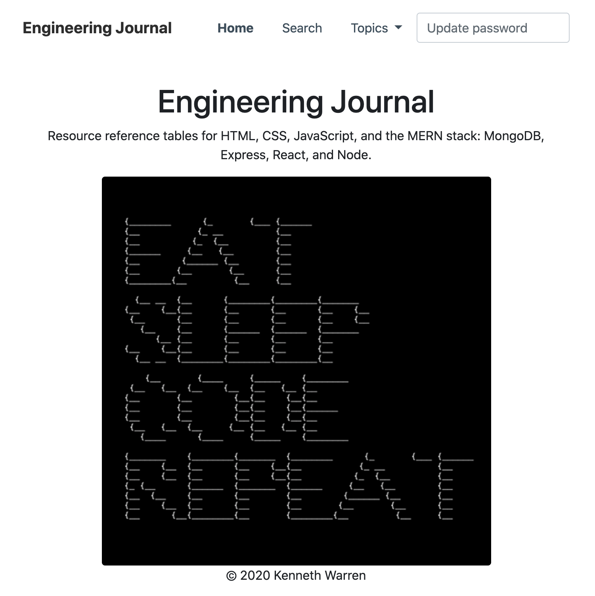
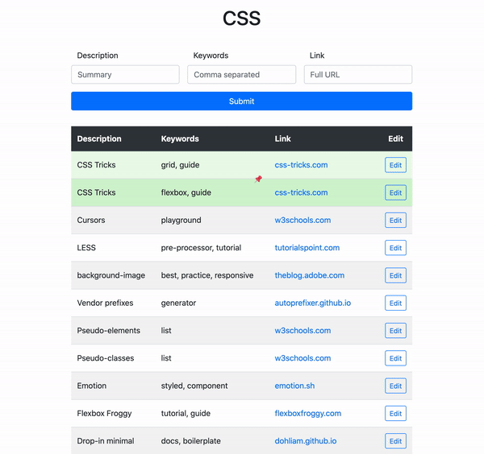
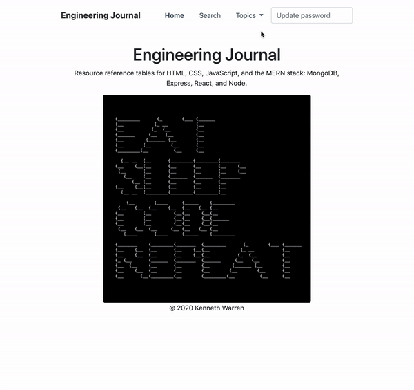
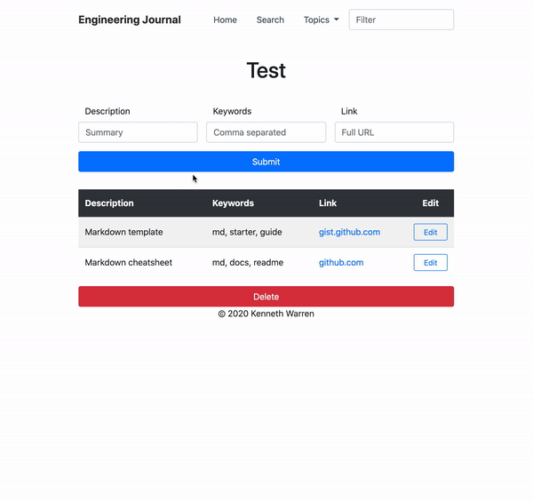
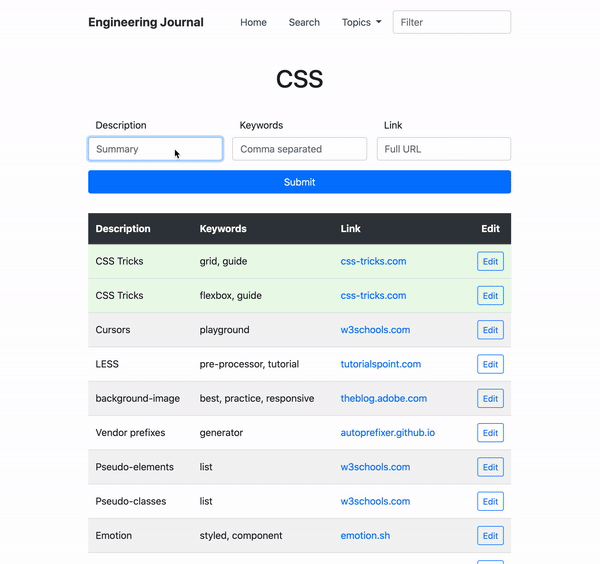

# Engineering Journal

Consolidate and organize browser bookmarks and links stashed throughout reading lists, note apps, docs, and spreadsheets.

## Docs on GitHub Pages
[Docs](https://warrenmfg.github.io/engineering-journal/)

***

## How to Use

Static `.html` files exist for HTML, CSS, JavaScript, and the MERN stack: MongoDB, Express, React, and Node. Customize as you see fit.

***

But a generic `topic.html` file exists as a template for custom topics, with full CRUD capabilities:

***

As well as full CRUD capabilities on each resource on all topics:

***

## Roadmap

- Consolidate this Engineering Journal repo and the [Engineering Journal API](https://github.com/WarrenMfg/engineering-journal-api) repo into single repo
- Add OAuth
- Update API codebase with documenation
- Convert to React single-page application

## License

This project is licensed under the MIT License - see the [LICENSE](LICENSE) file for details

## Acknowledgments

- [Dr. Ian Carnaghan](https://www.carnaghan.com/)
